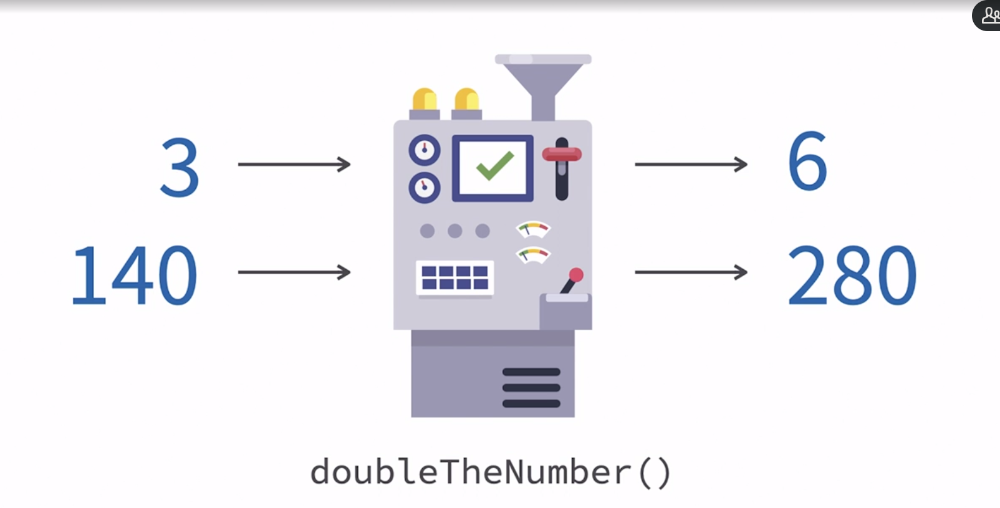

# learning_linkedin_java_lambdas_streams

# Linkedin lambdas and streams

[lambda repo](https://github.com/LinkedInLearning/java-lambdas-streams-2453107)

# functional programming
- they  are call pure function too, which means, for the same input, same output

  

- function could have functions as input


## functional interface
 - base for lambda function
 - they could be use as a functional argument
 - you could not add more than one method to keep it as a functional interface

```java
@FunctionalInterface
public interface Greeting {
    void sayHello();
}

```

## passing lambda as argument
```java
List<Integer> list = new ArrayList<>();
list.add(1);
list.add(2);
list.add(3);
list.forEach((e) -> {
    System.out.println(e);
});
```

## invoking functionalInterface
 1. building a class base on it
 2. anonymous class
 3. lambda function

```java
@FunctionalInterface
public interface Greeting {
    void sayHello();
}

Greeting greeting2 = new Greeting() {
    @Override
    public void sayHello() {
        System.out.println("Hello");
    }
};

greeting2.sayHello();

Greeting greeting3 = () -> System.out.println("Hello");
greeting3.sayHello();
```

```java
list.forEach(n -> {
    System.out.println(n);
});
```

## how to implement a lambda
 1. write the functional interface


```java
@FunctionalInterface
public interface Calculator {
    int calculate(int x, int y);
}
```
 2. implement the functional interface with one class

```java
@FunctionalInterface
public interface Calculator {
    int calculate(int x, int y);
}
Calculator calculator = (x, y) -> {
    Random random = new Random();
    int randomNumber = random.nextInt(50);
    return x + y + randomNumber;
};
```

## java.util.function
[java.util.function](https://docs.oracle.com/javase/8/docs/api/java/util/function/package-summary.html)  

 - group of functional interfaces to work with integers, doubles, strings, ...., and the general one which is function

 - there are some kind of functions
 1. Binary: get two values and return one


```java
DoubleBinaryOperator calculator = (x, y) -> {
    Random random = new Random();
    double randomNumber = random.nextDouble();
    return x + y + randomNumber;
};

System.out.println(calculator.applyAsDouble(1, 2));
```
 
 2. Consumer: get the value, but does not return anything
    
```java
DoubleConsumer consumer = (x) -> {
    System.out.println(x);
};
consumer.accept(10);
```

 3. Function
 4. Supplier: return a value, without get any argument

```java
DoubleSupplier supplier = () -> {
    Random random = new Random();
    return random.nextDouble();
};
System.out.println("supplier "+supplier.getAsDouble());
```
 5. Unary operator: get just one value and return one value

```java
DoubleUnaryOperator operator = (x) -> {
    Random random = new Random();
    return x + random.nextDouble();
};

System.out.println("unitary : "+operator.applyAsDouble(10));
```

# general lambda function
1. function
get one value and return one   

```java
Function<String, Integer> strCounter = (x) -> {
    return x.length();
};

System.out.println("str counter: "+strCounter.apply("Hello"));
```

2. BiFunction
get two values and return one

```java
BiFunction<String, String, Integer> strCounter = (strOne, strTwo) -> {
    return strOne.length() + strTwo.length();
};

System.out.println("str counter: "+strCounter.apply("Hello", "World"));
```


3. consumer
get one value and return nothing
```java
Consumer<String> consumerString= (x) -> {
    System.out.println(x);
};
consumerString.accept("Hello");
```

4. BiConsumer
get two values and return nothing
```java
BiConsumer <String, Integer> strCounter2 = (x, y) -> {
    System.out.println("double consumer : "+x+" "+y);
};
strCounter2.accept("daniel", 10);
```

5. supplier
receives not parameters and return a value
```java
Supplier<String> supplier = () -> {
    return "Hello";
};
System.out.println(supplier.get());
```

7. predicate: return a boolean
get one parameter and return a boolean
```java
Predicate <String> predicate = (x) -> {
    return x.length() > 5;
};
System.out.println("less than "+predicate.test("Hello"));
```

8. BiPredicate
get two parameters and return a boolean
```java
BiPredicate <String, Integer> predicate2 = (x, y) -> {
    return x.length() > y;
};
System.out.println(predicate2.test("asdfas", 10));
```

9. UnaryOperator
receive one parameter and return the same type value
```java
UnaryOperator <String> operator = (x) -> {
    return x.toUpperCase();
};
operator.apply("hi there");
```

10. BinaryOperator
receive two parameters and return the same type value
```java
BinaryOperator <String> operator2 = (x, y) -> {
    return x + y;
};
operator2.apply("daniel", " molina");
```

# operations with lambda functions
# lambda functions composition

### predicate
```java
BiPredicate <String, Integer> predicate2 = (x, y) -> {
    return x.length() > y;
};

BiPredicate <String, Integer> predicate3 = (x, y) -> {
    return x.length() > y;
};

BiPredicate <String, Integer> predicate4 = (x, y) -> {
    return x.length() > y;
};

predicate2.and(predicate3).or(predicate4).test("daniel", 10);
```
### functions
```java
    strCounter.andThen(strCounter2).compose(strCounter3).apply(10);
```

# Streams
- they are immutable
- go through a list and do some operations, without alter the initial list
- they can only be use once

before streams
```java
List<Integer> list = new ArrayList<>();
list.add(1);
list.add(2);
list.add(3);
list.add(4);

for(int i:list){
    i=i*i;
    if(i<10){
        System.out.println("the chosen one is  : "+i);
    }
}
```

with streams

```java
List<Integer> numbers = Arrays.asList(1, 2, 3, 4, 500, 6, 7, 8, 9, 10);
numbers.stream().
    map(n -> n * n).
    filter(n -> n > 10).
    sorted().
    forEach(System.out::println);
```


# stream methods
## stream intermediate methods
they are in the middle, they return another stream

- sorted
- filter
- map


## stream terminal methods
they are in the end, they return nothing

- forEach

# stream creation
```java
Integer[] scores = new Integer[]{1,2,34,5,6,8};
Stream<Integer>  scoresStream = Arrays.stream(scores);
```

# stream of integers
```java
int[] integers = new int[] {20, 98, 12, 7, 35};
int min = Arrays.stream(integers).
    min().
    getAsInt();
```

# stream.of strings
useful for create a stream of strings
```java
List<String> listFood = Arrays.asList("milk", "banana", "water", "orange", "rice");
Stream<String> streamFood = listFood.stream();
```

# stream.of
useful for create streams base on a bunch of objects, for do some composition

```java
Stream<Integer> letters = Stream.of(1, 2);
```

# stream with objects
```java
class Employee{
    public String name;
    public Employee(String name){this.name=name;}
}
Stream<Employee> employeeStream = Stream.of(new Employee("juan"), new Employee("daniel"));

employeeStream.
    map(e -> e.name).
    sorted().
    forEach(System.out::println);
```

# stream operations
```java
List<String> listFood = Arrays.asList("milk", "banana", "water", "orange", "rice", "pear");
listFood.
    stream().
    sorted().
    map(String::toUpperCase).
    map(String::new).
    filter(s -> s.startsWith("P")).
    forEach(System.out::println);
```

# :: operator
- the double colon operator is useful for apply maps, using static methods,   and constructors

# Streams State
```java
String name = "test";
List<String> listFood = Arrays.asList("milk", "banana", "water", "orange", "rice", "pear");
listFood.
    stream().
    sorted().
    map(String::toUpperCase).
    map(String::new).
    filter(s -> s.startsWith("P")).
    forEach(System.out::println); 
```

# Stream State
the stream could be use just one time, whenever you do some operations on there, it is not useful anymore

```java

List<String> listFood = Arrays.asList("milk", "banana", "water", "orange", "rice", "pear");
Stream<String> streamFood = listFood.
    stream();

streamFood.
    sorted().
    map(String::toUpperCase).
    map(String::new).
    filter(s -> s.startsWith("P"));

streamFood.forEach(System.out::println);  
```

# Stream collect
useful to transform a list in another list, it is a terminal operator
```java
List<String> listFood = Arrays.asList("milk", "banana", "water", "orange", "rice", "pear");

List<String> sorted = listFood.
    stream().
    sorted().
    map(String::toUpperCase).
    filter(s -> s.startsWith("P")).
    collect(Collectors.toList());
    
sorted.
    stream().
    forEach(System.out::println);
```